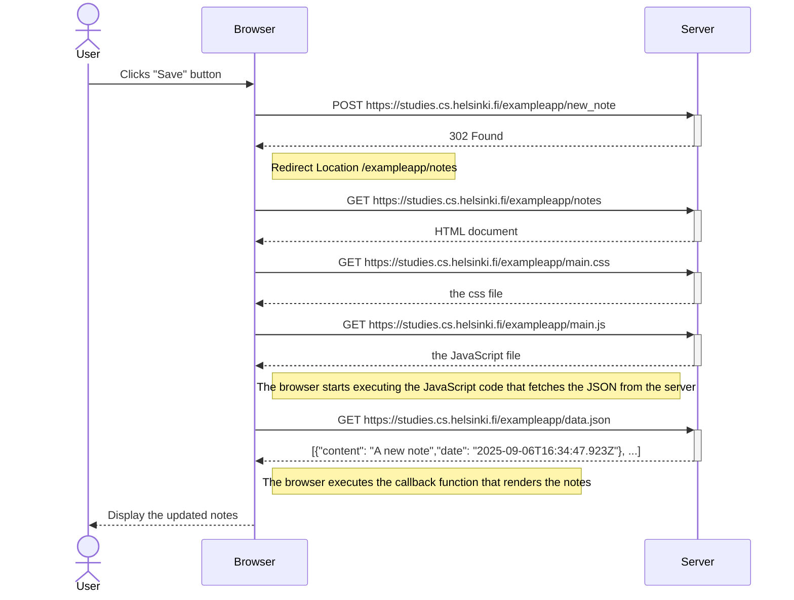

# Exercise 0.4 Solution

```mermaid
sequenceDiagram
    actor U as User
    participant B as Browser
    participant S as Server

    U->>B: Clicks "Save" button
    B->>+S: POST https://studies.cs.helsinki.fi/exampleapp/new_note
    S-->>-B: 302 Found
    note right of B: Redirect Location /exampleapp/notes
    
    B->>+S: GET https://studies.cs.helsinki.fi/exampleapp/notes
    S-->>-B: HTML document

    B->>+S: GET https://studies.cs.helsinki.fi/exampleapp/main.css
    S-->>-B: the css file

    B->>+S: GET https://studies.cs.helsinki.fi/exampleapp/main.js
    S-->>-B: the JavaScript file
    Note right of B: The browser starts executing the JavaScript code that fetches the JSON from the server

    B->>+S: GET https://studies.cs.helsinki.fi/exampleapp/data.json
    S-->>-B: [{"content": "A new note","date": "2025-09-06T16:34:47.923Z"}, ...]
    Note right of B: The browser executes the callback function that renders the notes

    B-->>U: Display the updated notes
```