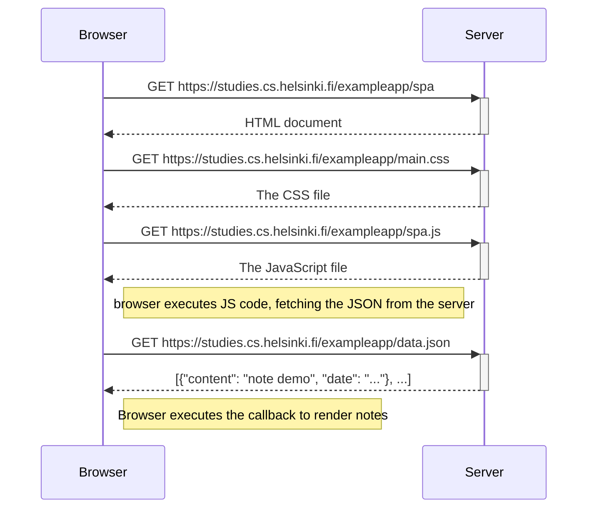

# Exercise 0.5 solution

```mermaid
sequenceDiagram
    participant B as Browser
    participant S as Server

    B->>+S: GET https://studies.cs.helsinki.fi/exampleapp/spa
    S-->>-B: HTML document

    B->>+S: GET https://studies.cs.helsinki.fi/exampleapp/main.css
    S-->>-B: The CSS file

    B->>+S: GET https://studies.cs.helsinki.fi/exampleapp/spa.js
    S-->>-B: The JavaScript file
    note right of B: browser executes JS code, fetching the JSON from the server

    B->>+S: GET https://studies.cs.helsinki.fi/exampleapp/data.json
    S-->>-B: [{"content": "note demo", "date": "..."}, ...]
    note right of B: Browser executes the callback to render notes
```