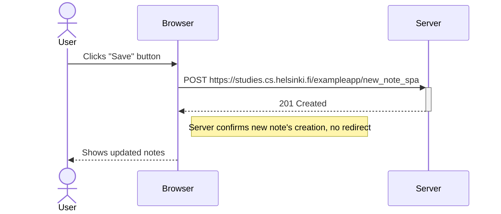

# Exercise 0.6 solution

```mermaid
  sequenceDiagram
    actor U as User
    participant B as Browser
    participant S as Server

    U->>B: Clicks "Save" button

    B->>+S: POST https://studies.cs.helsinki.fi/exampleapp/new_note_spa
    S-->>-B: 201 Created
    note right of B: Server confirms new note's creation, no redirect

    B-->>U: Shows updated notes

```